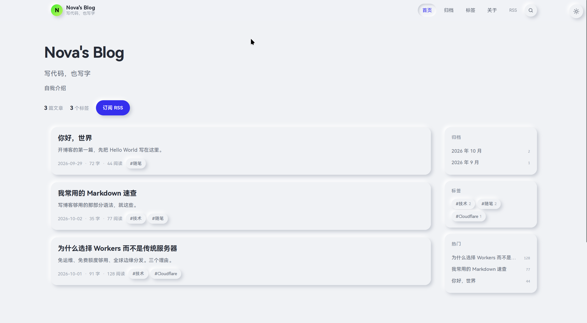
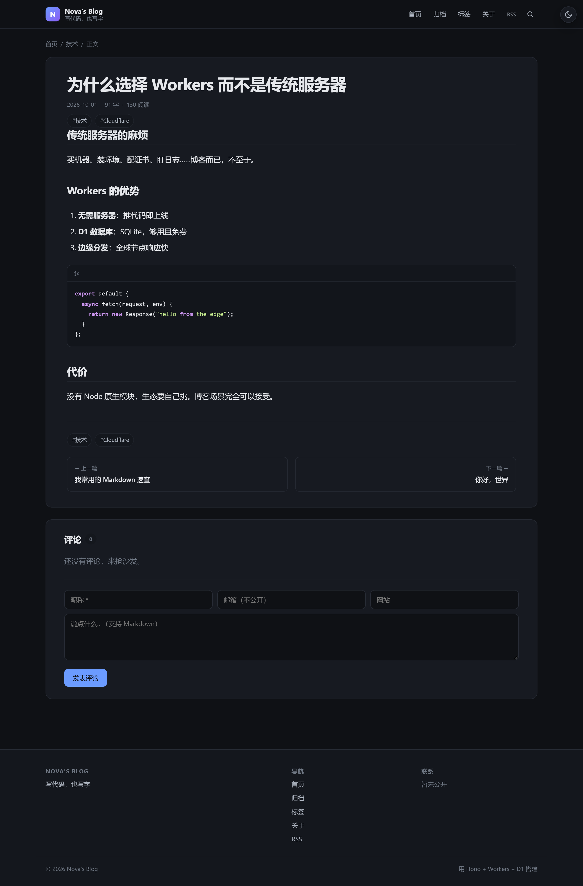
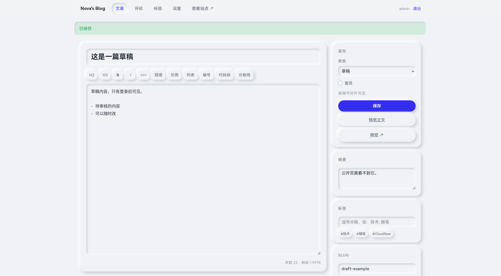
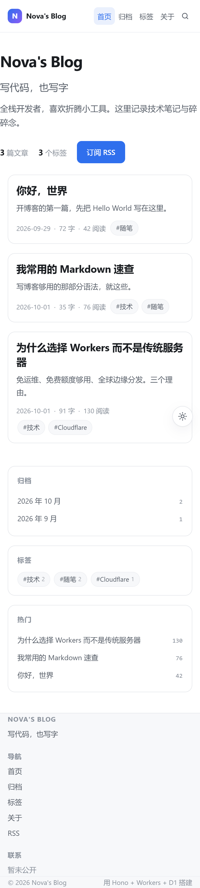

# BerryBlog

Cloudflare Workers + D1 的全栈个人博客。**不是静态站** —— 有真正的后端、数据库和管理后台，但依然零服务器运维。

   
## 界面预览

| 首页 | 文章页 |
| --- | --- |
|  |  |

| 后台编辑器 | 移动端 |
| --- | --- |
|  |  |

更多截图在 [`screenshots/`](screenshots/) 目录，含深色模式、归档、标签、关于、登录、设置页。

**要部署到自己的 Cloudflare？** 看 **[`DEPLOY.md`](DEPLOY.md)** —— 9 步清单 + 命令速查 + 常见报错。

---

## 功能

**公开端**
- 首页 / 归档（按月）/ 标签页 / 全文搜索（`/` 或 `Ctrl+K` 呼出）
- 文章详情：Markdown 渲染、代码高亮、自动目录（TOC）、阅读进度条、上一篇/下一篇
- 评论系统（嵌套回复、待审后公开、反垃圾）
- **下载区**（后台可增删改，每项支持多个下载源 + 分源计数）
- RSS `/rss.xml`、sitemap `/sitemap.xml`、robots.txt、Open Graph 分享图
- 深浅色主题（跟随系统 + 手动记忆），响应式适配手机
- 访问计数（同小时去重，不刷量）

**后台 `/admin`**
- Markdown 编辑器（工具栏 + 实时字数 + 预览 + `Ctrl+S` 保存）
- 文章 CRUD、草稿/发布、置顶、自定义 slug、封面
- 标签管理（孤儿标签自动清理）
- **下载项管理**（增删改、排序、推荐标记、每项挂 N 个下载源）
- 评论审核（通过 / 撤回 / 删除 / 垃圾）
- 站点设置（站名、副标题、关于页、页脚、评论开关）
- 修改密码（改完自动踢掉其他设备）

**安全**
- 密码 PBKDF2-SHA256（10 万轮）+ 常量时间比较
- 会话 token 存 D1，Cookie `HttpOnly` + `SameSite=Lax` + `Secure`
- 全站 CSRF 双提交令牌
- 登录限流 10 次/15 分钟，评论限流 5 条/小时（按 IP 指纹，不存明文 IP）
- CSP / `X-Content-Type-Options` / `X-Frame-Options` 等响应头
- 所有文本转义，**不注入原始 HTML**，天然免疫 XSS

---

## 快速开始

### 1. 准备

- Node.js 18+
- 一个 Cloudflare 账号（免费即可）

### 2. 本地跑起来

```bash
npm install

# 建表 + 灌示例数据（本地）
npm run db:init
npm run db:seed:local

# 启动，默认 http://127.0.0.1:8787
npm run dev
```

打开 <http://127.0.0.1:8787> 看前台，`/admin` 进后台。

> 默认账号 **admin / admin123**，登录后立刻去 `/admin/settings` 改密码。

### 3. 跑测试

```bash
# 另开一个终端
npm run dev
# 再开一个终端
node test/smoke.mjs
```

86 项断言，覆盖全部公开路由、后台鉴权、写文章、XSS 注入、评论审核、改密全流程。可重复运行（用唯一 slug + 自清理，不污染数据库）。

截图（可选，用系统已装的 Edge，不用下载 Chromium）：

```bash
node test/screenshot.mjs    # 输出到 screenshots/
```

---

## 部署到 Cloudflare

### 第 1 步：创建 D1 数据库

```bash
npx wrangler login          # 浏览器里授权
npx wrangler d1 create blog
```

命令会输出一串 `database_id`，复制它。

### 第 2 步：填进配置

编辑 `wrangler.jsonc`，把 `REPLACE_WITH_YOUR_D1_ID` 换成你的 ID：

```jsonc
"d1_databases": [
  {
    "binding": "DB",
    "database_name": "blog",
    "database_id": "你的-ID-在这里"
  }
]
```

### 第 3 步：初始化线上数据库

```bash
npm run db:init:remote      # 建表
npm run db:seed:remote      # 灌示例数据（含默认管理员）
```

### 第 4 步：部署

```bash
npm run deploy
```

完成。终端会给出 `https://berryblog.<你的子域>.workers.dev`。

**改密码**（默认的 admin123 必须改）：

最简单的方式是上线后登 `/admin/settings` 改。或者命令行：

```bash
node test/gen-hash.mjs '你的新密码'
# 把输出的hash 灌进去
npx wrangler d1 execute blog --remote --command "UPDATE users SET password_hash='<hash>' WHERE username='admin';"
```

### 第 5 步（可选）：绑定自定义域名

```bash
npx wrangler domains add blog.example.com
```

或去 Cloudflare Dashboard → Workers → 你的 Worker → Settings → Domains。

> **完整的部署清单、命令速查表、常见报错**见 [`DEPLOY.md`](DEPLOY.md)

---

## 换成你自己的信息

编辑 `wrangler.jsonc` 的 `vars`：

```jsonc
"vars": {
  "SITE_NAME": "你的博客名",
  "SITE_TAGLINE": "一句话简介",
  "AUTHOR_NAME": "你的名字",
  "AUTHOR_BIO": "自我介绍",
  "AUTHOR_AVATAR": "https://.../avatar.png",
  "GITHUB_URL": "https://github.com/xxx",
  "X_URL": "",
  "EMAIL": "you@example.com",
  "COMMENT_ENABLED": "1",
  "ITEMS_PER_PAGE": "8"
}
```

改完 `npm run deploy` 生效。

> 站名、副标题、关于、页脚这几个也可以在后台 `/admin/settings` 改，改的是数据库值，优先级高于 `vars`。

### 清除示例文章

```bash
npx wrangler d1 execute blog --remote --command \
  "DELETE FROM post_tags; DELETE FROM posts; DELETE FROM tags WHERE id NOT IN (SELECT tag_id FROM post_tags);"
```

---

## 目录结构

```
blog/
├─ src/
│  ├─ index.ts              入口：路由挂载 + 安全头 + 静态资源
│  ├─ types.ts              类型定义
│  ├─ routes/
│  │  ├─ public.ts          首页/文章/归档/标签/搜索/下载/RSS/评论
│  │  └─ admin.ts           登录/文章 CRUD/评论/标签/设置
│  └─ lib/
│     ├─ markdown.ts        零依赖 Markdown 渲染器（含 TOC、高亮）
│     ├─ db.ts              D1 查询 + backfillHtml 自愈
│     ├─ auth.ts            会话 + CSRF + 限流
│     ├─ crypto.ts          PBKDF2 / token / IP 指纹
│     ├─ layout.ts          页面骨架 + 组件
│     └─ utils.ts           slug / 转义 / 分页 / 时间格式化
├─ public/                  静态资源（CSS / JS / 图标）
├─ schema/
│  ├─ schema.sql            建表
│  └─ seed.sql              种子数据（html 留空，运行时渲染）
└─ test/
   ├─ smoke.mjs             端到端冒烟测试（86 项断言）
   ├─ gen-hash.mjs          生成密码哈希
   └─ screenshot.mjs        批量截图（用系统 Edge，无需下载浏览器）
```

---

## 一些设计取舍

**为什么自己写 Markdown 渲染器**
Workers 没有 Node 原生模块生态，引入 marked/remark 会让 bundle 涨一大截，而这个博客只需要常用语法。自写的版本 300 行，支持标题/列表/任务列表/表格/代码块/引用/分割线 + 自动 TOC + 轻量语法高亮，且天然全转义没有 XSS 面。

**为什么 `posts.html` 存渲染结果**
避免每次请求重复渲染。但直接改 Markdown 渲染器后旧文章不会更新 —— 所以加了 `backfillHtml()`：只对 `html` 为空的行补渲染。改渲染器后可以这样刷新：

```bash
npx wrangler d1 execute blog --remote --command "UPDATE posts SET html='';"
```

下次访问即自动重建。

**为什么用 `SET_COOKIE` 时要 encodeURIComponent**
中文 slug 直接放进 Cookie 的 `Path=` 会抛 `Invalid header name or value`（Fetch 规范要求 ASCII），浏览器里会直接报错。访问计数的 Cookie 已做编码处理。

**评论为什么默认待审**
个人博客最怕垃圾评论刷屏。默认全部进待审箱，你在后台一键通过。

---

## 常见问题

**Q：`wrangler dev` 报 database_id 无效**
本地开发用 `.wrangler/state` 里的模拟库，不需要真 ID。只有 `deploy` 和 `--remote` 才需要。

**Q：改了 `wrangler.jsonc` 的 `vars` 但页面没变**
`vars` 只在部署后生效。本地要改就编辑 `.dev.vars`。

**Q：D1 免费额度够吗**
够。D1 免费版 5 GB 存储、每天 5 万次读 + 5 万次写。个人博客日均几百 PV 完全是零成本。

**Q：能不能换数据库**
可以。`src/lib/db.ts` 是唯一的数据访问层，换 Neon / Supabase Postgres 只需要重写这个文件和 `schema/`。

**Q：怎么加 RSS 全文输出**
编辑 `src/routes/public.ts` 里 `/rss.xml` 的 `items.map`，把 `<content:encoded>` 填上 `p.html` 即可（`xmlns:content` 已在根节点声明）。

---

## 已知边界

这些是有意取舍，不是遗漏：

- **没有富文本编辑器**。后台是纯 Markdown（带工具栏和预览）。要富文本得引入编辑器库，Workers 上体积和兼容性都不划算。
- **图片只能填外链 URL**。要上传图片得配 R2（Cloudflare 的对象存储），加一个 bucket 绑定即可，README 里没写因为按需再加更清爽。
- **评论不支持编辑**。发出去就定了，删或重发。
- **中文 slug 直接进 URL**。`/p/冒烟测试文章` 这样，可用但不好看。想让 slug 强制英文在保存时手填 `slug` 字段。
- **搜索是 SQL LIKE**，没有分词。数据量到几千篇就该上 D1 Vectorize 或外部搜索了。
- **没有多用户**。`users` 表结构支持多用户，但后台只有单账号登录流程。
- **没有图片上传、没有草稿自动保存**。编辑器 `Ctrl+S` 是走正常提交，中途关掉会丢。

---

## 可以怎么扩展

| 想加 | 改哪 |
| --- | --- |
| 图片上传 | 加 R2 binding + `public/upload.js`，在 `admin.ts` 加 `/admin/upload` 路由 |
| 代码块复制按钮 | `public/app.js` 里给 `.code-block` 注入按钮 |
| 全文搜索 | `schema.sql` 加 FTS5 虚表，`db.ts` 的 `countPublished`/`getPublishedPosts` 换查询 |
| 多语言 | `settings` 加 `locale`，`markdown.ts` 的 `extractSummary` 按语言分词 |
| 定时发布 | 加 `published_at` 已经是未来时间的过滤条件，索引已就位 |
| 邮件订阅 | Cloudflare Workers + Workers KV 存订阅列表，接 Resend API |
| 相册/图床页 | 新建 `src/routes/gallery.ts`，`app.route('/gallery', gallery)` |
